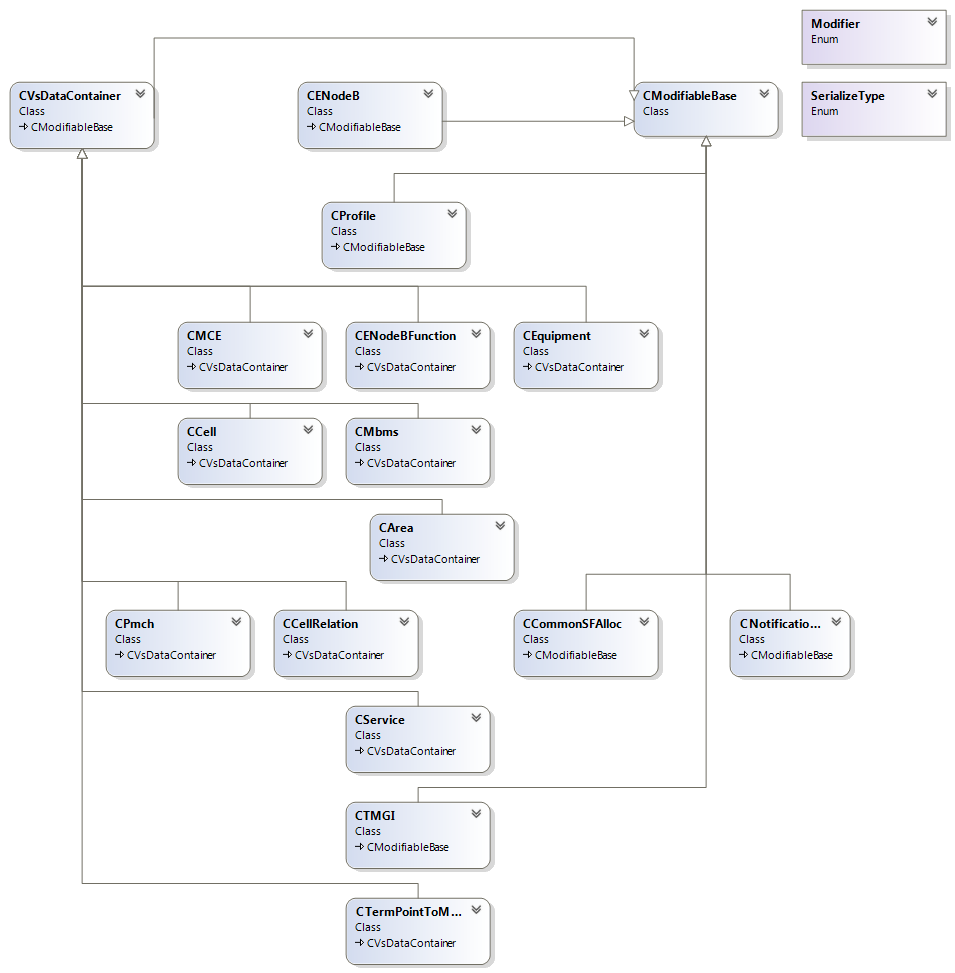

### Description
**ETool** is a **GUI** tool written in **C#**, which can:  
* **Report** remote **eNodeBs**' info to local **profiles**, **config** local **profiles** to remote **eNodeBs** and **activate** it.  
* Run **bcgtool** on **OSS servers** by **SSH** and manage **OSS server** list and **profiles** locally.   

**bcgtool simulator** is a simulator for bcgtool for develop and test without real **OSS servers**.
### Requirements DONE before:
* **Import** eNodeB sites/names from **`.csv`** file and **Manage** OSS servers on GUI.
* Send **report cmd** to servers, **download** **`.xml` report** files  
* Load **`.xml` report** files into **Data Model** and save to **`.pfl` profile** files on disk.
* **Load/Display/Modify/Delete** local **`.pfl` profile** files on GUI.
* Display **cmd excution process** on GUI.
* Associate **profile** to **eNodeB** on GUI with virtualized **Report profile**.

* Corresponding response to **report cmd** in **bcgtool simulator**.

### Requirements TODO in the plan:
* **Load** local **`.pfl` profile** files, do **delta comparison** with remote eNodeB **`.xml` report** files and save to **`.xml` config** files
* Upload **`.xml` config** files and send **config cmd** and **activate cmd** to server.

* Corresponding response to **config cmd** and **activate cmd** in **bcgtool simulator**.

###	Alternatives
####3.1. Considering the business model, C/S should be more suitable.
- Reinvent the wheel in my familiar architecture maybe faster, stronger and easier.
####3.2. The “pfl” format sucks. Save xml files just as xml files.
- We only need a transfer between xml files to our models.
<table style="margin-left:27px">
  <td>xml files</td>
  <td style="border:0px"><==></td>
  <td>data model</td>
  <td style="border:0px;"><=X=></td>
  <td>pfl files</td>
</table>
####3.3. Use data models generated from xsd files to auto serialize and deSerialize XML files
<table style="margin-left:27px">
  <td>xsd files</td>
  <td style="border:0px">=auto=></td>
  <td>data model</td>
  <td style="border:0px"><=auto=></td>
  <td>xml files</td>
</table>
####3.4. Use Generic classes to refactor data models to make serialize and deSerialize to be easier

### Optimized by me
* Display cmd excution process on GUI <b style="background-color:#ACD55D">dynamically and user-friendly</b>.
* Associate **profile** to **eNodeB** on GUI with <del>virtualized **Report profile**</del> dynamic buttons.
* Load **`.xml` report** files into **Data Model** and save to **<del>`.pfl`</del> `.xml` profile** files on disk.
* **Load/Display/Modify/Delete** local **<del>`.pfl`</del> `.xml` profile** files on GUI.
* Optimize user stories, do **report** and **config** together.
* Move some global variables into **`.xml` settings** file.
* Standardize **local/global directory paths** and **file name with timestamps**
* Code itself **64K => 55K**
* **...**

### DONE by me: 
* **Serialize/Deserialize profile/report/config Data Model** to/from **`.xml` profile/report/config/lock/unlock** files
* **Config/Minus/Delta : profile DM - eNodeB DM = config DM** 
* **Unit tests** for above Serialize and Minus functions.
* Save **program excution status** into log on disk.
* Generate **error log** files and response to **config/activate cmd** in **bcgtool 
* **Parse** response of **cmd** and download **error log** files from server.simulator** .
* **...**
